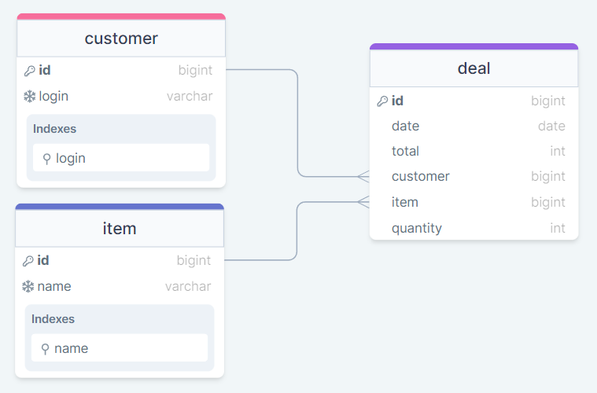

# test_case_pronin_team

<details>
<summary><b>ЗАДАНИЕ:</b></summary>

<b>Задача</b>

Реализовать веб-сервис на базе django, предоставляющий REST-api и способный:

1. Принимать из POST-запроса .csv файлы для дальнейшей обработки
2. Обрабатывать типовые deals.csv файлы, содержащие истории сделок
3. Сохранять извлеченные из файла данные в БД проекта
4. Возвращать обработанные данные в ответе на GET-запрос.

<b>Требования</b>

1. Данные хранятся в реляционной БД, взаимодействие с ней осуществляется посредством django ORM.
2. Ранее загруженные версии файла deals.csv не должны влиять на результат обработки новых.
3. Эндпоинты соответствуют спецификации:

    <b>Выдача обработанных данных
    Метод: GET</b>

    В ответе содержится поле “response” со списком из 5 клиентов, потративших наибольшую сумму за весь период.  
    Каждый клиент описывается следующими полями:

    - username - логин клиента
    - spent_money - сумма потраченных средств за весь период;
    - gems - список из названий камней, которые купили как минимум двое из списка "5 клиентов, потративших наибольшую сумму за весь период", и данный клиент является одним из этих покупателей.

    <b>Загрузка файла для обработки
    Метод: POST</b>

    Аргументы:

    - deals: файл, содержащий историю сделок.

    Ответ:

    - Status: OK - файл был обработан без ошибок;
    - Status: Error, Desc: <Описание ошибки> - в процессе обработки файла произошла ошибка.

4. Приложение должно быть контейнирезировано при помощи docker;
5. Проект не использует глобальных зависимостей за исключением:  python, docker, docker-compose;
6. Readme проекта описывает весь процесс установки, запуска и работы с сервисом;
7. Требования к фронтенду не предъявляются, интерфейс взаимодействия — RestFul API;
8. Проект запускается одной командой.

<b>Будет плюсом</b>

1. Команда, используемая для запуска проекта - docker-compose up;
2. Кэширование данных, возвращаемых GET-эндпоинтом, с обеспечением достоверности ответов;
3. Сервис django работает на многопоточном WSGI-сервере;
4. API реализован на основе  DRF.

<b>Файлы</b>

deals.csv - содержит историю сделок по продаже камней. Описание полей deals.csv:

- customer - логин покупателя
- item - наименование товара
- total - сумма сделки
- quantity - количество товара, шт
- date - дата и время регистрации сделки

</details>

## Запуск

Для запуска рекомендованы команды "docker compose". Если ваша версия утилиты предполагает использование только команд формата "docker-compose" - учитите это при запуске проекта и замените во всех командах.

1. Клонировать репозиторий

    ```bash
    git clone <ссылка с git-hub>
    ```

2. Перейти в папку /test_case_pronin_team

    ```bash
    cd test_case_pronin_team/
    ```

3. Создать файл .env по образцу .env.example из репозитория.

4. Поднять контейнеры в режиме вывода логов в терминал

    ```bash
    docker compose up
    ```

    Или в фоновом режиме

    ```bash
    docker compose up -d
    ```

5. Админка доступна по адресу <http://127.0.0.1:8000/admin/>. Чтобы воспользоваться ей - необходимо создать суперпользователя локально, выполнив команду ниже и введя свои данные пользователя.

    ```bash
    docker compose exec backend python manage.py createsuperuser
    ```

6. Чтобы прекратить работу контейнеров воспользуйтесь командой

    ```bash
    docker compose down
    ```

    Если хотите прекратить работу контейнеров с удалением томов данных, то дополните команду флагом -v

    ```bash
    docker compose down -v
    ```

## Схема БД проекта



Индексы указаны только дополнительные, без учёта автоматически добавляемых Django

## Available endpoints

1. Загрузка нового csv-файла для обработки

    ```text
    http://127.0.0.1:8000/api/v1/add-deals
    ```

    Предоставленный для тестирования файл разположен в директории /test_case_pronin_team/test_data  
    Тестирование отправки файла на ручку проводилось через Postman с помощью form-data формата для отправки тела запроса.

    ### Формат запроса

    ```json
    {
        "deals": some_file.csv
    }
    ```

    ### Возможные ответы

    ```json
    {
        "Status": "OK"
    }
    ```

    ```json
    {
        "Status": "error",
        "Desc": "description"
    }
    ```

2. Получение списка топ-5 покупателей со списком камней

    ```text
    http://127.0.0.1:8000/api/v1/get-top
    ```

    ### Пример ответа

    ```json
    {
        "response": [
            {
                "username": "resplendent",
                "spent_money": 451731,
                "gems": [
                    "Танзанит",
                    "Рубин",
                    "Сапфир"
                ]
            },
            {
                "username": "bellwether",
                "spent_money": 217794,
                "gems": [
                    "Петерсит",
                    "Сапфир"
                ]
            },
        ]
    }
    ```

## Комментарии к решению

1. Если в отправленном файле есть строки, которые имеют пустые значения в ключах - они будут пропущены при создании сделок. Вероятно стоит сообщать пользователю о том, что не все строки обработаны, но следуя ТЗ возвращаю ответ OK, если других ошибок не возникло.
2. Одинаковые сделки не дублируются в базу. Уникальной сделка считается по сочетанию всех полей из файла.
3. GET запрос возвращает в ответе только клиентов, у которых были расходы. Если в базе не хватает информации, чтобы выбрать топ-5 клиентов, будет возвращено максимально возможное количество клиентов, которые совершали покупки. Если в базе нет ни одной сделки - содержание списка по ключу response будет пустым даже при наличии пользователей в базе. Считаю это верным поведением ручки.
4. Для кэширования в проект добавлен контейнер с Redis. Допускаю, что для данной задачи это может быть избыточно, но хранение в оперативной памяти мне не кажется правильной реализацией.
5. Не предполагается редактирование данных через админку - только просмотр. При изменении данных в админке не инвалидируется кэш, поэтому ответ API может быть некорректным.

## Контакты

**telegram** [@Menshikov_AS](https://t.me/Menshikov_AS)  
**e-mail** <a.menshikov1989@gmail.com>
